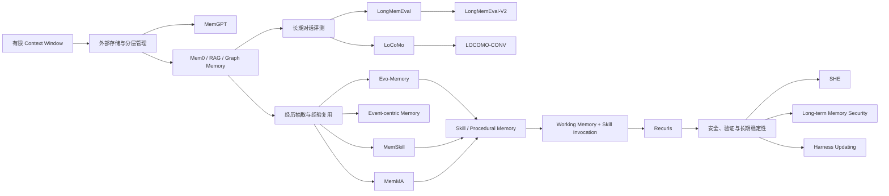

【上一篇文章我主要沿着 MCE、Meta-Harness、SHE、Recuris 这几篇论文，讨论了 agent memory 和安全自进化是怎么接起来的。这篇把视角拉宽一点，专门回答一个更基础的问题：现在大家说的 agent memory，到底都在做什么？这些工作之间有没有一条比较清楚的演化脉络？】

我先说一个目前比较认可的结论：

**agent memory 已经不太能简单理解成“给大模型外挂一个向量数据库”。**

早期的 memory 系统确实大多是在做：

- 把历史对话切成若干段；
- 存进向量数据库；
- 当前问题来了以后做相似度检索；
- 把检索结果拼回 prompt。

但现在的研究重点已经慢慢往后移了。大家开始问：

- 什么东西值得写入 memory？
- 一次经历应该保存成原始轨迹、事实、事件，还是可执行技能？
- memory 什么时候应该被调用？
- 如果旧知识和新知识冲突，应该怎么更新？
- memory 真的改变了 agent 的行为，还是只是让上下文更长？
- memory 被污染以后，如何回滚、隔离、审计？

所以我想用下面这条线来理解当前方向：

$$
\text{Storage}
\rightarrow
\text{Reflection}
\rightarrow
\text{Experience}
\rightarrow
\text{Controlled Self-Evolution}
$$

中文就是：

> 先把经历存下来，再对经历做总结，然后把总结变成可复用经验，最后让 memory 在验证和安全约束下自己更新。

这条线不一定是所有论文都严格遵循的时间顺序，但作为理解现在研究版图的主轴，我觉得是比较顺的。

## 1. 先别急着看具体方法：agent memory 到底是什么

一个普通 LLM 的调用可以写成：

$$
\hat y_t=f_\theta(x_t)
$$

模型只看到当前输入 $x_t$，模型参数 $\theta$ 在两次调用之间不变。

如果加入外部 memory，可以写成：

$$
\hat y_t=f_\theta(x_t, m_t)
$$

其中 $m_t$ 是在第 $t$ 步被写入、管理、检索并注入的记忆。

但这还不够，因为 $m_t$ 不是凭空出现的。一个真正的 agent memory 至少包含三个动作：

$$
\text{Memory Loop}
=
\text{Write}
\rightarrow
\text{Manage}
\rightarrow
\text{Read}
$$

也就是：

1. **Write**：从对话、工具轨迹、环境反馈中提取什么；
2. **Manage**：怎么合并、压缩、更新、删除、解决冲突；
3. **Read**：当前任务什么时候读什么、读多少、以什么格式注入。

这三个动作是连在一起的。

如果 write 做得不好，memory 里全是噪音；

如果 manage 做得不好，memory 会重复、矛盾、膨胀；

如果 read 做得不好，明明存对了也不会被 agent 用到。

所以我现在不太喜欢把 memory 简化成“存储层”。它更像是：

> 一个会参与当前决策的外部状态机。

这也解释了为什么现在的论文开始把 memory 和 workflow、skill、tool policy、verifier 放在一起研究。

## 2. 第一阶段：先把上下文从窗口里搬出去

### 2.1 MemGPT：memory 最早的系统化抽象

我觉得理解 agent memory，最适合从 MemGPT 开始。

论文：[MemGPT: Towards LLMs as Operating Systems](https://arxiv.org/abs/2310.08560)

MemGPT 的基本观察很简单：模型的 context window 是有限的，但是任务历史可能无限增长。如果所有历史都一直放在 prompt 里，要么超出窗口，要么引入严重的 attention dilution。

所以 MemGPT 借鉴操作系统的内存分层：

- 当前 context window 类似 main memory；
- 外部存储类似 disk；
- LLM 自己决定什么时候把内容换入、换出；
- 通过函数调用完成 memory management。

这时 memory 的核心不再是“把所有历史都放在上下文里”，而是让模型拥有一套显式的分页和管理机制。

MemGPT 的价值不一定是它的具体接口，而是它把问题换了个说法：

> 长上下文不是单纯的窗口扩展问题，而是一个状态管理问题。

这一步很关键。因为后面不管是 memory retrieval、working memory，还是 skill memory，本质上都在回答：

> 当前任务状态应该留在高带宽区域，哪些信息可以暂时移到外部？

### 2.2 从完整历史到摘要、事实和向量检索

MemGPT 之后，大量工作开始研究更轻量的 memory store：

- 保存原始对话；
- 保存摘要；
- 保存用户事实和偏好；
- 保存向量 embedding；
- 保存实体关系图；
- 保存某种时间线或事件结构。

典型的工程系统会把记忆操作拆成：

$$
\text{extract}
\rightarrow
\text{embed}
\rightarrow
\text{retrieve}
\rightarrow
\text{inject}
$$

这已经比“把全部聊天记录拼回去”好很多，但它仍然有一个隐含假设：

> 过去最有用的信息，大概就是和当前 query 语义相似的信息。

很多时候这个假设成立；但长程任务里，真正有用的东西不一定和问题表面相似。

例如：

- 当前问题问的是“下一步做什么”，真正有用的是上次失败后发现的操作顺序；
- 当前问题没有提到“用户不喜欢什么”，但这个偏好会决定回答风格；
- 当前工具调用看起来正常，但几步之前某个状态已经过期；
- 当前问题和过去的词不相似，但属于同一个任务家族。

所以 memory 研究很快就从“检索相关文本”开始往“检索可用经验”移动。

## 3. 第二阶段：memory 不只是存事实，还要保留经历

### 3.1 Mem0：工程上最容易落地的 memory-centric architecture

论文：[Mem0: Building Production-Ready AI Agents with Scalable Long-Term Memory](https://arxiv.org/abs/2504.19413)

Mem0 代表了一类很重要的工作：把 memory 作为 agent 的独立基础设施，而不是某个 prompt 技巧。

它的基本思路是动态地从对话中抽取重要信息，然后对已有 memory 做 add、update、delete 等操作，再在后续对话中检索相关内容。

Mem0 还比较了普通 memory、图结构 memory、RAG、full-context 等多种方案。它的意义更多在于系统化地展示了几个现实 trade-off：

- full-context 可能准确，但 token 和延迟太高；
- 单纯向量检索便宜，但对时间关系、多跳关系和事实更新不够稳；
- 图结构能够表示关系，但构建和维护成本更高；
- memory 的质量同时取决于抽取、合并和读取，而不只是检索器。

我觉得 Mem0 代表的是“production memory”路线。它关心的是：

> 怎么在可接受的延迟和成本下，让 agent 在多轮、多 session 交互中保持一致。

它还没有把 memory 做成完整的自进化系统，但已经把 memory 从“一个数据库”推进成了“一个有写入和维护逻辑的中间层”。

### 3.2 LoCoMo：开始认真测长期对话记忆

论文：[Evaluating Very Long-Term Conversational Memory of LLM Agents](https://arxiv.org/abs/2402.17753)

在 LoCoMo 之前，很多 memory demo 看起来不错，是因为历史很短，问题也很直接。LoCoMo 的价值在于，它构造了更长的多 session 对话，并且同时测试：

- factual question answering；
- temporal reasoning；
- event summarization；
- multimodal dialogue generation。

它让大家意识到，长期记忆不是“问一句，回忆一个事实”这么简单。

真正困难的是：

- 事情发生的时间顺序；
- 多次对话中观点是否发生变化；
- 一个事件和另一个事件之间的关系；
- 多模态信息如何和文本经验合并；
- 记忆应该回答到什么粒度。

LoCoMo 对我的启发是：

**如果 benchmark 只测单跳 factual recall，很多 memory 系统会被高估。**

一个系统可能很会找到“用户喜欢咖啡”，但不一定知道：

- 用户什么时候说过这句话；
- 后来是否改变过偏好；
- 这个偏好和当前任务有什么关系；
- 如果两个记忆冲突，应该信哪一个。

### 3.3 LongMemEval：从 recall 走向 memory abilities

论文：[LongMemEval: Benchmarking Chat Assistants on Long-Term Interactive Memory](https://arxiv.org/abs/2410.10813)

LongMemEval 比 LoCoMo 更明确地把 memory 拆成多个能力：

1. information extraction；
2. multi-session reasoning；
3. temporal reasoning；
4. knowledge updates；
5. abstention。

这个拆分我觉得特别好，因为它把“记得住”拆成了几个不同问题。

比如：

- 能否找到某个事实，是 retrieval；
- 能否把多个 session 拼起来，是 multi-session reasoning；
- 能否判断哪个说法更新，是 temporal reasoning + update；
- 不确定时能否承认不知道，是 abstention。

最后这个 abstention 经常被忽略，但其实很重要。

memory 系统最大的危险之一，不是忘记，而是**自信地读出错误的旧记忆**。

如果 memory 里有冲突信息，agent 应该选择：

- 旧事实；
- 新事实；
- 两者都提供；
- 询问用户；
- 直接 abstain。

所以 memory 的正确性不能只看 recall，还要看：

$$
\text{Memory Quality}
\neq
\text{Retrieval Recall}
$$

至少还要考虑时间、冲突、适用条件和不确定性。

## 4. 第三阶段：从“记住什么”走向“从经历中学到什么”

这是我觉得现在最关键的一次转向。

很多早期系统记住的是：

- 用户说了什么；
- 发生了什么；
- 某个文件里有什么；
- 某个时间点的状态。

但 agent 真正需要的经常是：

- 这类任务应该先做什么；
- 哪种工具调用顺序容易失败；
- 什么情况下某条经验不适用；
- 失败后应该如何修复；
- 哪个策略在不同任务上可以复用。

这就是“experience reuse”。

我会把它区分成两种 memory：

### Episodic memory

记录某次具体经历：

> 在任务 A 中，agent 先调用工具 X，得到错误 Y，然后改用工具 Z 成功。

### Procedural memory

抽象成未来可以执行的策略：

> 当工具 X 返回 Y 类型错误时，先检查参数状态，再切换到工具 Z。

前者像录像，后者像技能。

二者当然不是互相替代。原始轨迹保留上下文，程序性技能提供复用效率。

问题是：**什么时候应该从 episodic memory 抽象出 procedural memory？**

### 4.1 Evo-Memory：让 memory 进入 streaming test-time learning

论文：[Evo-Memory: Benchmarking LLM Agent Test-time Learning with Self-Evolving Memory](https://arxiv.org/abs/2511.20857)

Evo-Memory 是我觉得当前 memory 研究里非常重要的 benchmark/framework。

它的核心批评是：很多已有评测只测静态 conversational recall，memory 被动地从过去对话中检索信息回答问题，却不测 agent 能不能从前面的任务中学到东西。

Evo-Memory 把数据组织成 sequential task streams：

$$
x_1\rightarrow x_2\rightarrow x_3\rightarrow \cdots \rightarrow x_T
$$

每完成一个任务，agent 都可以：

- 搜索旧 memory；
- 根据新经验适配策略；
- 更新 memory；
- 在后续任务中复用。

它还明确区分：

- **conversational recall**：记得过去说过什么；
- **experience reuse**：把过去的经验变成未来任务的帮助。

这句话我很喜欢：

> agent 记住了 what was said，却没有学会 what was learned。

Evo-Memory 提供 ExpRAG baseline，并提出 ReMem，把 action、think、memory refine 放进同一个 pipeline。

这意味着 memory 不再是 task solving 之后附带写一下，而是开始进入 task execution loop：

$$
\text{Action}
\rightarrow
\text{Observation}
\rightarrow
\text{Reasoning}
\rightarrow
\text{Memory Refinement}
$$

这一步的研究问题已经从“memory 能不能找到答案”变成：

> 经验是否被正确抽象，并且能否改变后面任务的决策？

### 4.2 MemSkill：把 memory operation 本身做成 skill

论文：[MemSkill: Learning and Evolving Memory Skills for Self-Evolving Agents](https://arxiv.org/abs/2602.02474)

MemSkill 的出发点是：很多 memory 系统把 add、update、delete、skip 这些操作写死了。

例如，固定的流程可能是：

1. 每轮对话提取一条 memory；
2. 和旧 memory 做相似度匹配；
3. 相似就合并，不相似就新增；
4. 超过大小就 prune。

这种流程简单，但把很多人类先验硬编码进去了。

MemSkill 的做法是把 memory construction 重新定义成可学习、可演化的 memory skills。

它大致包含三个角色：

- controller：选择当前应该使用哪些 memory skills；
- executor：根据选中的 skills 生成或更新 memory；
- designer：检查困难案例，提出新的 skill 或修订旧 skill。

也就是说，memory 不只是被动的存储结果，**memory extraction 本身也变成了一个可以学习的策略。**

这和 MCE 的关系很有意思：

- MCE 演化的是“如何构造 context”的 skill；
- MemSkill 演化的是“如何构造 memory”的 skill。

它们其实共享一个更一般的观点：

> 不要把外部状态的写法固定死，让 agent 学会如何写外部状态。

### 4.3 MemMA：memory cycle 不能拆成互不相干的三个模块

论文：[MemMA: Coordinating the Memory Cycle through Multi-Agent Reasoning and In-Situ Self-Evolution](https://arxiv.org/abs/2603.18718)

MemMA 进一步指出，memory 有三个互相影响的阶段：

1. construction；
2. retrieval；
3. utilization。

很多系统却把它们做成三个独立模块：

- 一个模块负责写 memory；
- 一个模块负责检索；
- 一个模块负责回答。

这样会出现两个问题：

### Strategic blindness

memory construction 和 retrieval 只根据局部启发式做决定，不知道未来任务到底需要什么。

### Sparse and delayed feedback

memory 写进去之后，可能过了很久才发现它没有用，甚至误导了后续推理。

MemMA 的思路是在 forward path 和 backward path 都加上 agentic reasoning：

- Meta-Thinker 生成结构化指导；
- Memory Manager 负责 construction；
- Query Reasoner 负责 iterative retrieval；
- 失败的 probe QA 被转成 memory repair action。

这比简单的“检索 top-k”复杂，但它更接近真实 memory 的闭环：

$$
\text{Construction}
\leftrightarrow
\text{Retrieval}
\leftrightarrow
\text{Utilization}
$$

如果 retrieval 失败，可能不是检索器的问题，而是 memory 根本没被写对；

如果最终回答失败，可能不是模型推理错，而是 retrieval 提供了错误证据；

如果 memory 总是被忽略，可能是它和当前 query 的表面相似度不够，但和当前任务状态其实高度相关。

MemMA 的价值就是把这些阶段重新放回一个 cycle 里看。

## 5. 第四阶段：memory 开始变成状态控制和自进化系统

### 5.1 Recuris：memory 的核心不是 storage，而是 control

论文：[Recuris: Recursive Experiential–Working Memory Evolution for Long-Horizon Agent Harnesses](https://arxiv.org/abs/2608.24876)

Recuris 是目前我最喜欢的一篇 memory 论文，因为它直接碰到了长程 agent 最难受的问题：

**历史越来越多，但 agent 对当前状态越来越糊涂。**

Recuris 把 memory-control layer 写成：

$$
M^k=(E^k,W^k,\rho^k,C^k)
$$

其中：

- $E^k$：Experiential Memory，保存可复用 skills；
- $W^k$：Working Memory specification，定义当前任务状态；
- $\rho^k$：invocation policy，决定什么时候调用哪些技能；
- $C^k$：checker set，判断 observation 是否支持状态更新。

它和普通 memory 的区别在于：working memory 不是聊天摘要，而是一个当前任务状态。

可以粗略写成：

$$
w_t=\text{Update}(w_{t-1},o_t)
$$

然后根据当前状态 $w_t$ 去选择经验技能：

$$
s_t=\rho(w_t,E)
$$

这就解决了一个常见问题：

> 不是 memory 里没有正确经验，而是 agent 不知道现在该用哪一条。

Recuris 的跨任务更新还带有明确的验证门：

1. 执行任务；
2. 收集结构化 trace；
3. 把失败定位到某个 memory component；
4. 只对被归因的组件做局部 patch；
5. 在失败任务和 held-out development set 上验证；
6. 如果出现回退，就不接受更新。

形式上可以写成：

$$
\text{Accept}(M^{k+1})=
\begin{cases}
1, & \text{source task improves and held-out does not regress}\\
0, & \text{otherwise}
\end{cases}
$$

这一步很重要，因为 memory evolution 如果没有 gate，很容易变成“每次失败都往 memory 里加一条规则”。

那样短期可能提升，长期一定膨胀。

Recuris 报告在四个长程 benchmark、十个模型上，37 个完整 model-benchmark pair 里有 35 个提升；最长任务的收益扩大到 +32.2 points，常见长程失败最多下降 80%。

我不想只重复这个数字，我更关心它背后的结论：

> 收益来自会自我修订的 memory-control layer，而不是简单把更多上下文塞进 prompt。

论文里甚至发现，把整个 skill library 都放进 prompt，context 更长、成本更高，表现反而更差。

这说明 memory 的关键不只是“存了什么”，而是：

- 当前状态是什么；
- 什么时候触发；
- 触发哪条技能；
- 技能是否真的适用；
- 状态变化是否有 observation 支撑。

### 5.2 Memory 不是唯一的外部可变层

读到这里，memory、skill、context、harness 其实已经越来越难分开。

可以把 agent 外部状态写成：

$$
H=
(P_{\text{sys}},
M_{\text{task}},
M_{\text{skill}},
M_{\text{safe}},
Q_{\text{tool}},
V)
$$

其中：

- $P_{\text{sys}}$：系统行为契约；
- $M_{\text{task}}$：任务事实；
- $M_{\text{skill}}$：可复用经验；
- $M_{\text{safe}}$：安全边界和反例；
- $Q_{\text{tool}}$：工具权限；
- $V$：验证器和 gate。

MCE 主要研究怎么演化 context skill；

Meta-Harness 研究怎么搜索完整 harness；

MemSkill 研究怎么演化 memory skill；

Recuris 研究怎么在长程任务中演化 memory-control layer；

SHE 研究怎么演化 safety harness。

这几条线其实已经汇合了。

## 6. 当前 memory 研究的几种“表示形式”

如果只按照“短期记忆 / 长期记忆”分类，我觉得已经不够用了。现在更重要的是问：memory 被表示成什么。

### 6.1 Raw trajectory memory

保存原始交互轨迹：

```text
任务 → 工具调用 → 观察 → 错误 → 修复 → 成功
```

优点是上下文最丰富，适合回放和诊断。

缺点是太长，检索和迁移困难。

SkillEvolBench 里一个很有意思的观察就是：raw trajectory reuse 有时会超过 distilled skill。

这并不代表抽象没用，而是说明：

> 抽象过程本身可能丢掉真正有用的程序性线索。

### 6.2 Fact / semantic memory

把轨迹压缩成事实、偏好、实体、关系：

```text
用户偏好：喜欢简洁回答
项目状态：数据库迁移尚未完成
实体关系：A 属于 B
```

这类 memory 很适合个性化和多轮对话，但不一定能表达“怎么做”。

### 6.3 Event-centric memory

以事件为中心，而不是以固定 chunk 为中心：

```text
时间、参与者、动作、结果、前置条件、后续影响
```

它比普通 chunk 更适合时间推理和因果关联。

### 6.4 Graph memory

把实体、事件、关系组织成图。

图结构能显式表达多跳关系，但图的构建、更新、冲突解决也更复杂。

所以“用了 graph memory”不等于一定更好。真正要看任务是否真的需要关系结构。

### 6.5 Skill / procedural memory

保存的是：

- 什么时候适用；
- 需要哪些前置条件；
- 具体步骤；
- 如何检查结果；
- 什么时候不能用。

这已经不是普通事实记忆，而是外部程序性知识。

### 6.6 Working memory / state memory

保存当前任务的：

- 未完成目标；
- 当前状态；
- 已验证事实；
- 待处理异常；
- 下一步候选动作。

这类 memory 对长程 agent 尤其重要。因为很多失败不是缺少过去经验，而是当前状态管理失败。

## 7. 当前 memory 研究的几种“写入方式”

同样是 memory，写入策略不同，系统行为会差很多。

### Always-write

每一轮都写。

优点是简单，不容易漏；

缺点是噪声和膨胀非常严重。

### Heuristic-write

通过规则判断“重要性”：

- 新事实；
- 用户偏好；
- 任务完成；
- 失败；
- 置信度变化。

优点是便宜；

缺点是规则很容易和任务分布绑定。

### Reflective-write

任务结束后让模型反思：

> 这次经历里，什么对以后有用？

它能形成更抽象的经验，但会引入模型自己的幻觉和过度总结。

### Skill-conditioned write

先选择一组 memory skills，再决定怎么从轨迹里抽取 memory。

MemSkill 就属于这条路线。

### Outcome-gated write

只有在结果、验证器或 held-out 集合支持时，才把更新写入长期 memory。

Recuris、SHE 以及各种 self-evolution harness 工作都在往这个方向走。

## 8. 当前 memory 研究的几种“读取方式”

### Similarity retrieval

最常见，也最容易部署：

$$
m_t=\operatorname{TopK}\big(\operatorname{sim}(q_t,m_i)\big)
$$

问题是语义相似不一定代表当前可用。

### Temporal retrieval

考虑时间顺序、最近更新、事实有效期。

这对偏好变化和知识更新很重要。

### Multi-hop / graph retrieval

先找一个实体，再沿关系找到相关事件或证据。

适合复杂关系，但代价更高。

### State-grounded invocation

根据 working state 决定调用哪个 skill，而不是只根据 query。

Recuris 里这点是核心。

### Proactive retrieval

用户没有明确问，但 agent 判断某条 memory 可能会影响当前决策，于是主动调用。

这是 conversational memory 下一步很值得研究的方向。最近的 LOCOMO-CONV 就开始关注“用户没有直接问出来，但上下文中隐含需要用到 memory”的情况。

## 9. 评测正在发生什么变化

我觉得 memory benchmark 的变化可以概括成四步：

### 第一步：能不能找回来

典型问题：

> 过去对话里用户说过什么？

主要测 recall 和 factual QA。

### 第二步：能不能组合和更新

开始测：

- 多 session reasoning；
- 时间顺序；
- 新旧事实冲突；
- abstention。

LongMemEval 就属于这一阶段。

### 第三步：能不能影响任务行为

不再只问“回答对不对”，而是问：

> memory 是否改变了 agent 的下一步动作？

这也是 experience reuse、tool-use memory、coding agent memory 的核心。

### 第四步：能不能持续学习并且不变坏

最新的方向开始测：

- sequential task streams；
- frozen deployment；
- cross-task transfer；
- held-out no-regression；
- safety / utility trade-off；
- activation / adherence；
- memory poisoning 和 unauthorized retrieval。

LongMemEval-V2 把目标描述成让 agent 变成 specialized environment 里的 experienced colleague，并把上下文深度推进到超过 100M tokens 的 web-agent 历史。

这说明 benchmark 正从“长期聊天记忆”走向“长期工作记忆”。

而 Evo-Memory、SkillEvolBench、Recuris 这类工作，则进一步测：

> agent 是否能把一次经历转化为后续任务可复用的能力。

## 10. 一张比较完整的 Agent Memory 论文地图



我自己会把这些论文分成六层：

| 层次 | 主要问题 | 代表论文 |
|---|---|---|
| 1. 存储 | 历史怎么放到 context 之外 | MemGPT |
| 2. 记忆系统 | 怎么抽取、检索、合并、删除 | Mem0、图 memory |
| 3. 长期评测 | 记忆是否正确、及时、能处理冲突 | LoCoMo、LongMemEval |
| 4. 经验复用 | 记住的是事实还是策略 | Evo-Memory、SkillEvolBench |
| 5. memory control | 什么时候调用、如何维护当前状态 | MemSkill、MemMA、Recuris |
| 6. 安全自进化 | 更新是否可验证、可回滚、不污染系统 | SHE、RSEA、Harness Updating |

## 11. 现在这个领域最容易混淆的几件事

### 11.1 Memory 和 RAG 不是一回事

RAG 通常是：

> 给定外部知识库，检索相关证据回答当前问题。

Agent memory 更强调：

> 这个系统从过去交互中形成了什么状态，并且如何在未来改变行为。

如果知识库是人工固定的，它更像 RAG；

如果 agent 会从交互中写入、更新、遗忘，并且这些变化影响后续任务，它才更接近 memory。

### 11.2 Memory 和 Context Engineering 也不是一回事

Context engineering 关注的是：

> 当前调用应该给模型看什么。

Memory 关注的是：

> 跨调用保留什么，以及未来什么时候再用。

两者在实际系统里会重叠，但时间尺度不同：

- context 是当前步；
- memory 是跨步状态；
- harness 是管理两者的外部系统。

### 11.3 Memory 变大不等于 agent 变强

这是最容易被忽略的。

如果 memory 越写越多，但：

- 检索不到；
- 检索到了不相关；
- 和当前状态冲突；
- agent 不遵守；
- 旧经验覆盖新事实；

那 memory 可能只是噪声源。

所以我现在越来越倾向于用下面这个公式想 memory：

$$
\text{Useful Memory}
=
\text{Stored}
\times
\text{Retrieved}
\times
\text{Grounded}
\times
\text{Followed}
$$

其中任何一项接近 0，最终收益都接近 0。

## 12. 我觉得现在最值得追的开放问题

### 12.1 Episodic 到 procedural 的抽象损失

什么时候应该保留 raw trajectory，什么时候应该抽象成 skill？

是否可以让 agent 同时保存：

- 原始轨迹；
- 结构化事件；
- 程序性技能；
- 失败反例。

然后根据任务难度动态选择粒度？

### 12.2 Memory update 的因果归因

如果某次更新之后性能提升了，提升到底来自：

- memory 内容；
- retrieval 策略；
- prompt 位置；
- agent 本身随机性；
- benchmark 结构；
- 额外 token 和 compute。

这和 Harness Updating 里的 update quality / harness benefit 问题是同一个根。

### 12.3 Learned forgetting

现在很多系统擅长写入，不擅长遗忘。

但长期 memory 如果不能删除：

- 过期事实；
- 错误经验；
- 被污染的规则；
- 只适用于单个 episode 的 patch；

系统最终一定会变得越来越难用。

所以 forget 不是 memory 的反面，而是 memory management 的核心操作。

### 12.4 Memory security

带持久化写入的 agent 多了一种风险：

攻击者不一定要马上让模型输出危险内容，也可以先把恶意信息写进 memory，再等未来任务触发。

因此 memory security 具有：

- persistence；
- statefulness；
- propagation。

这和普通 prompt injection 不完全一样。需要单独研究：

- memory poisoning；
- cross-session contamination；
- unauthorized retrieval；
- sensitive memory leakage；
- shared memory 的权限隔离。

### 12.5 Memory 和工具权限的联合控制

一个 memory 即使文本上没有危险，也可能诱导 agent 采取危险工具动作。

所以真正安全的 memory system 不能只检查“写入的文字”，还要检查：

> 这条 memory 被读取后，会允许 agent 做什么？

SHE 把 safety memory 和 tool policy 拆开，是我觉得很值得沿用的设计。

### 12.6 多模态和 embodied memory

现实 agent 的经验不只有文本：

- 屏幕状态；
- 图片；
- 语音；
- 工具返回的结构化数据；
- 环境变化；
- 失败时的动作上下文。

如何把这些信息压缩成既可检索、又可执行、还不会丢掉关键状态的 memory，仍然没有统一答案。

## 13. 我建议的阅读顺序

如果是第一次系统进入 agent memory，我建议不要从最新论文开始，而是按问题依赖来读：

1. **MemGPT**：理解为什么需要外部 memory 和分层管理。
2. **LoCoMo**：理解长期对话 memory 到底难在哪里。
3. **LongMemEval**：把 memory 拆成 extraction、temporal reasoning、update、abstention 等能力。
4. **Mem0**：看一个偏工程落地的 memory-centric architecture。
5. **Evo-Memory**：从“记住事实”进入“复用经历”。
6. **MemSkill**：理解 memory extraction 为什么可以成为可学习 skill。
7. **MemMA**：理解 construction、retrieval、utilization 为什么是一个闭环。
8. **Recuris**：看 working memory、skill invocation、validation gate 如何接起来。
9. **SHE**：最后把 memory 放进 agent safety 和 tool policy 场景。

如果读完这九篇，我觉得基本就能看懂现在的大部分 agent memory 工作在地图上的位置了。

## 14. 最后的理解

现在的 agent memory，大概经历了这样的变化：

### 第一种理解：memory 是外部存储

目标是把历史放到 context window 外面，需要时再取回来。

### 第二种理解：memory 是信息压缩器

目标是从长对话里提取事实、摘要、事件和关系。

### 第三种理解：memory 是经验库

目标不是记住发生过什么，而是把经历变成下次任务可以复用的策略。

### 第四种理解：memory 是控制层

目标是管理当前任务状态、决定什么时候调用经验、检查状态变化是否有证据。

### 第五种理解：memory 是可进化但受约束的外部系统

目标是在真实任务反馈中更新 memory，同时通过验证、回滚、安全边界和 no-regression gate，防止系统越学越坏。

所以，如果让我现在用一句话总结这个方向，我会写成：

> Agent memory 的发展，不是从“小数据库”变成“大数据库”，而是从“存储过去”逐渐变成“控制现在，并安全地影响未来”。

这也是我觉得 agent memory 最值得继续研究的地方。

真正困难的可能不是让 agent 记住更多，而是让它知道：

- 什么值得记；
- 什么只能暂时记；
- 什么应该忘掉；
- 什么经验可以迁移；
- 什么经验只适用于上一次；
- 什么时候应该相信 memory；
- 什么时候应该拒绝 memory；
- 什么时候应该让 verifier 或人来决定。

