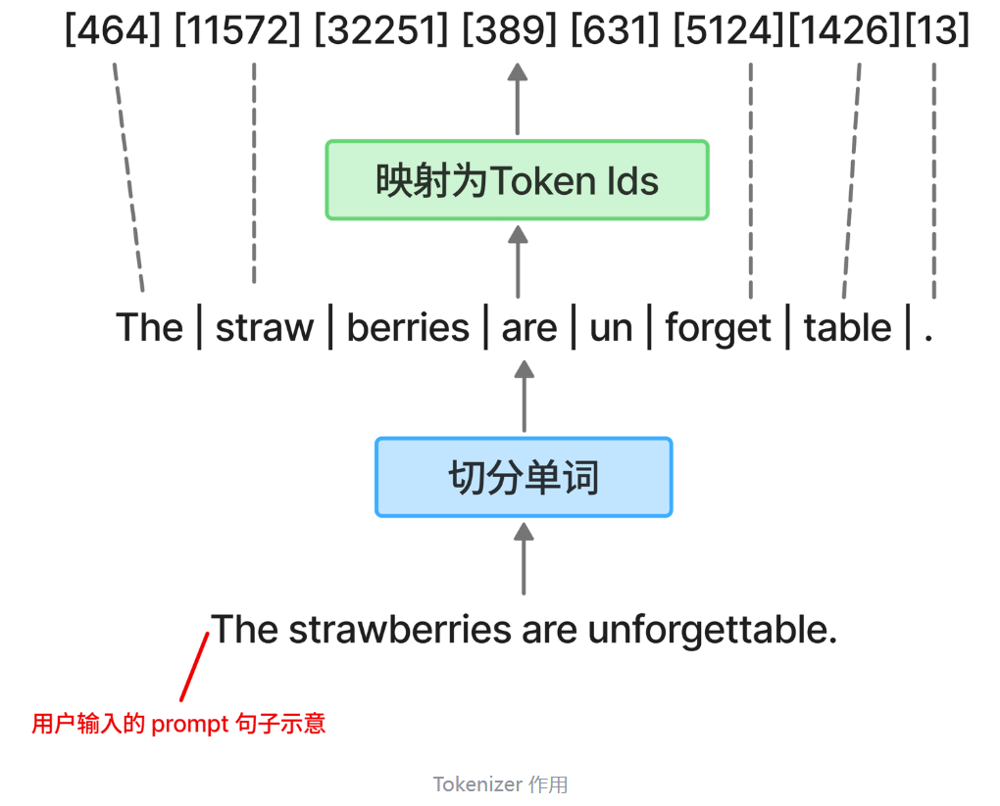

**Tokenizer,即分词器，说到底只有这两个功能：**
1. **切分句子为单词**
2. **将单词映射为其对应的ID**



**计算机读不懂单词、字母、汉字，所以要把字符映射为数字**
这就是 Tokenizer 诞生的初衷。**它的任务不仅仅是把句子切开，而是要建立一套映射标准。**
它要告诉模型：在这个世界里，
- "我" 不是一个汉字，而是编号 1001。
- "爱" 不是一种情感，而是编号 2345。
- "你" 不是一个对象，而是编号 5678。

一旦完成了这一步转换，原本无法计算的文字处理任务，就变成了数学上的序列预测问题。模型不再是在“写作文”，而是在计算：当数列 [1001, 2345] 出现时，下一个数字是 5678 的概率是多少？

##### 字符切分(Character-based)方案:
> "h e l l o"
>      ↓
> [104, 101, 108, 108, 111]

一个大优点是不会OOV(Out of Vocabulary)
一个大坏处是难以学到"词意"，比如apple变成了a p p l e，它很难拼出来这就是apple，这就导致训练需要更长的链条:字符 → 子词 → 单词 → 语义（举个例子:c+a+t → "cat" → 动物 → 语义）；而不是现代的:子词（token） → 语义
另一个好处是字符会很少，整套英文只需要存26个字母，加上常用的各种符号数字，也不过256个左右。坏处是哪怕是apple这个单词，都会需要五个维度去储存，非常稀疏，而且似乎这种方法无法表示汉字(可以只存常用的5k个汉字，但这样其实存储字符少的优点比起BPE也不大了) 

##### 单词切分 (Word-based)方案:
> "hello world"
> ↓
> [1234, 5678]

优点：
+ 语义直接对齐，dog就是狗的意思
+ 序列很短，hello一个ID即可表示
+ 训练更容易，token = 语义单位
  
缺点：
+ OOV，比如ChatGPT-6.0，单词表里没有，直接不理解
+ 词表爆炸，60w英文单词，中文更是灾难，各种词语，成语，俚语都要收录，不然就是一个OOV
+ run，running，runner，是完全不同的ID，根本理解不到他们的语义相关性

##### BPE（Byte Pair Encoding）方案:
**核心思想**
**从字符开始，反复合并最常见的“相邻字符对”**

举个例子

训练数据：

> low
lowest
newer
wider

**初始：**

> l o w
l o w e s t

**第一步：统计频率**
> "l o" 出现最多 → 合并

👉 新 token：

> lo

**不断重复：**

> lo + w → low

** 最终得到：**

> ["low", "est", "new", "er"]

我们可以使用下面的代码尝试一下最简单的BPE：
```python
from collections import Counter

def get_stats(words):
    pairs = Counter()
    for word in words:
        for i in range(len(word) - 1):
            pairs[(word[i], word[i + 1])] += 1
    return pairs

def merge_pair(words, pair):
    a, b = pair
    merged = []
    for word in words:
        new_word = []
        i = 0
        while i < len(word):
            if i < len(word) - 1 and word[i] == a and word[i + 1] == b:
                new_word.append(a + b)
                i += 2
            else:
                new_word.append(word[i])
                i += 1
        merged.append(new_word)
    return merged

def train_bpe(corpus, num_merges=10):
    words = [list(word) for word in corpus]
    merges = []

    for _ in range(num_merges):
        stats = get_stats(words)
        if not stats:
            break
        best_pair = stats.most_common(1)[0][0]
        merges.append(best_pair)
        words = merge_pair(words, best_pair)

    return merges

def encode(word, merges):
    tokens = list(word)
    for pair in merges:
        tokens = merge_pair([tokens], pair)[0]
    return tokens

# demo
corpus = ["low", "lowest", "newer", "wider"]
merges = train_bpe(corpus, num_merges=10)

print("merges:", merges)
print("encode('lowest'):", encode("lowest", merges))
print("encode('newer'):", encode("newer", merges))
```

上面的代码运行结果是：

```python
merges: [('l', 'o'), ('lo', 'w'), ('e', 'r'), ('low', 'e'), ('lowe', 's'), ('lowes', 't'), ('n', 'e'), ('ne', 'w'), ('new', 'er'), ('w', 'i')]
encode('lowest'): ['lowest']
encode('newer'): ['newer']
```

**一.先把每个单词切分为Character-based级别，这个操作只需要下面一行代码：**

```python
words = [list(word) for word in corpus]
```

例如：

```python
["low", "lowest"] -> [['l', 'o', 'w'], ['l', 'o', 'w', 'e', 's', 't']]
```

**二.统计每个单词里的相邻两个字符的出现频率**
这就是 `get_stats` 函数做的事情。
最开始一轮，学到的 pairs 大致有：

```python
Counter({
    ('l', 'o'): 2,
    ('o', 'w'): 2,
    ('w', 'e'): 2,
    ('e', 'r'): 2,
    ('e', 's'): 1,
    ('s', 't'): 1,
    ('n', 'e'): 1,
    ('e', 'w'): 1, 
    ('w', 'i'): 1,
    ('i', 'd'): 1,
    ('d', 'e'): 1
})
```

这里要注意，BPE 不是把所有字符打乱之后去统计“谁出现得多”，而是统计**谁和谁经常相邻出现**。它依赖的是顺序信息，而不是单个字符的全局频率。

**三.从这些 pairs 里找到频率最大的那个，然后在每个 word 里按照这个 pair 合并**
具体合并就是每个 word 里，从这个 list 头到尾扫描，每次看看当前两个元素是不是 `best_pair`，
是的话就合并，不是就继续往下扫描。
所以这个过程的本质很像一种贪心合并。

**四.执行合并规则之后，重新开始新一轮循环**
每执行完一次合并，整个语料的 token 序列就都会发生变化。
于是下一轮统计出来的“最高频相邻对”也会跟着变化，BPE 就这样一轮一轮把更大的子词拼出来。

比如一开始可能先学到：

```python
('l', 'o') -> 'lo'
('lo', 'w') -> 'low'
('e', 'r') -> 'er'
```

所以，BPE 真正学到的并不是“某个单词长什么样”，而是一套 **merge rules（合并规则）**。
后面碰到新单词时，也不是去查完整单词字典，而是按照这些规则一步一步合并。

**五.到这里为止，上面的代码其实还只做了一半**
它学会了 **怎么合并字符、怎么把字符串切成 token**，但还没有完成 Tokenizer 最关键的另一半：

1. `encode`：把文本变成 token，再变成 id
2. `decode`：把 id 还原成 token，再还原成文本

也就是说，上面的代码更像一个**最小 BPE 训练器**，而不是一个完整的 Tokenizer。

**六.Tokenizer 还需要一张 vocab 表**
BPE 训练完之后，我们已经拿到了很多 token。
一开始的 token 来自最小单位，也就是字符本身；后续每做一次 merge，又会得到一个新的 token。

所以 vocab 不是“训练结束之后凭空冒出来”的，而是：

1. 先有一套初始 token
2. 再把 BPE 合并出来的新 token 继续加进去

在工业级 Tokenizer 里，初始 vocab 往往一开始就有内容，比如常用字符，或者更常见地，直接是 256 个 byte。
但在我们这个最小例子里，可以直接从训练语料里收集字符，再把 merge 出来的 token 加进去：

```python
def build_vocab(corpus, merges):
    base_tokens = sorted(set("".join(corpus)))

    vocab = {}
    for token in base_tokens:
        vocab[token] = len(vocab)

    for a, b in merges:
        token = a + b
        if token not in vocab:
            vocab[token] = len(vocab)

    return vocab
```

这样，`vocab` 就是一个最简单的 `token -> id` 映射。

比如它可能长这样：

```python
{
    'd': 0,
    'e': 1,
    'i': 2,
    'l': 3,
    'n': 4,
    'o': 5,
    'r': 6,
    's': 7,
    't': 8,
    'w': 9,
    'lo': 10,
    'low': 11,
    'er': 12
}
```

**七.encode：文本 -> token -> id**
这时我们才算真正拥有了一个可以编码文本的 Tokenizer。

```python
def encode_to_ids(word, merges, vocab):
    tokens = encode(word, merges)
    ids = [vocab[token] for token in tokens]
    return tokens, ids
```

把前面的代码接起来：

```python
corpus = ["low", "lowest", "newer", "wider"]
merges = train_bpe(corpus, num_merges=10)
vocab = build_vocab(corpus, merges)

tokens, ids = encode_to_ids("lowest", merges, vocab)
print("tokens:", tokens)
print("ids:", ids)

tokens, ids = encode_to_ids("newer", merges, vocab)
print("tokens:", tokens)
print("ids:", ids)
```

如果 `lowest` 被切成 `['low', 'est']`，那它后面就会再变成类似 `[11, 15]` 这样的 id 序列；
如果在这个玩具例子里它最终被直接合并成了 `['lowest']`，那也会对应成一个单独的 id。

这时候就能看出：**BPE 负责的是“怎么切”，vocab 负责的是“切完之后怎么编号”。**

**八.decode：id -> token -> 文本**
既然有 `encode`，就一定要有 `decode`。
否则模型吐出来一串 id，人类还是看不懂。

```python
def decode_from_ids(ids, vocab):
    id_to_token = {idx: token for token, idx in vocab.items()}
    tokens = [id_to_token[i] for i in ids]
    text = "".join(tokens)
    return tokens, text
```

继续测试：

```python
tokens, ids = encode_to_ids("lowest", merges, vocab)
decoded_tokens, decoded_text = decode_from_ids(ids, vocab)

print("decoded_tokens:", decoded_tokens)
print("decoded_text:", decoded_text)
```

这时整个闭环就完整了：

```python
text -> tokens -> ids -> tokens -> text
```

Tokenizer 真正做的事情，其实就是这一整套双向翻译。

**九.这里要注意一个小细节**
由于我们前面设置的是：

```python
num_merges = 10
```

这个数字对这么小的语料来说已经比较大了，所以最后 `lowest` 和 `newer` 很可能会被直接合并成一个完整 token。

于是你会看到：

```python
encode("lowest", merges) -> ['lowest']
encode("newer", merges) -> ['newer']
```

这并不影响理解，因为 BPE 的核心思想没有变：
**先从最小单位出发，不断合并高频相邻对，再把最终得到的 token 映射为 id。**

如果想更明显地看到 `low + est`、`new + er` 这种“子词效果”，可以把 `num_merges` 调小一些。

**十.所以，BPE 和 Tokenizer 其实不是一回事**
严格来说：

1. **BPE** 负责学习“怎么合并、怎么切分”
2. **vocab** 负责记录“每个 token 对应哪个 id”
3. **encode / decode** 负责完成“文本世界”和“数字世界”之间的双向转换

三者合起来，才是一个完整的 Tokenizer。

参考文献:
>全网最全的大模型分词器（Tokenizer）总结 - 干的就是大模型的文章 - 知乎
https://zhuanlan.zhihu.com/p/1947688136684574286

>大模型回归基本功之1——Tokenizer：万物皆可被数字化 - Ryann的文章 - 知乎
https://zhuanlan.zhihu.com/p/1991625129969615976

>【LLM拆了再装】 Tokenizer篇 - coreyzhong的文章 - 知乎
https://zhuanlan.zhihu.com/p/700283095
