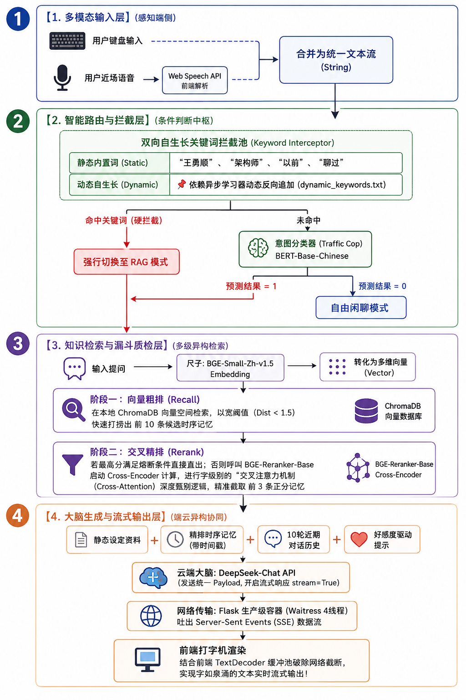

<div class="definition">
项目地址: https://github.com/legend91019/Your-Desktop-dialogue-robot
</div>



## 项目总体架构

+ 输入层
  - 语音输入
  - 打字输入
+ 分类层
  - 关键词拦截
    * 自带必要关键词
    * 随着用户和AI对话"生长出来的"关键词
  - 分类器classifier分类
+ 回答层
  - 分类层判定为不需要检索资料:只带着上下十段对话的短期记忆和用户交流
  - 分类层判定为需要检索(retrieval)
    * 首先，向量粗排，这一步是直接用余弦相似度计算距离最近的10份资料
    * 然后，注意力细排(reranker)，把粗排找到的十份资料和用户问句拼在一起进行注意力打分，选出分数最高的3句话
    * 细排得到的资料是"长期记忆"，把人格提示词，短期记忆，长期记忆，用户任务，好感度拼接为提示词
+ 输出层
  - 一个线程把提示词发给云端大模型，得到回答
  - 一个线程将总结提示词发给大模型，总结触发搜索的关键词以及将记忆存入向量数据库
  - 大模型流式文字回答，回答后会有语音回答(可选，在浏览器上语音效果不好，语音清洗掉了一些动作描写之类的)


---
# 项目总览

## 一、 系统启动阶段：核心资产挂载与初始化

当后端执行 `python simple.py` 时，系统并不会直接等待请求，而是先在后台进行**昂贵的单次硬件资源初始化**，防止每次对话都重复加载导致内存爆炸：

```
[系统启动] 
   │
   ├──> 1. 加载意图分类器 (TextClassifier) ──> 挂载“交通警察”权重
   ├──> 2. 初始化持久化数据库 (ChromaDB) ──> 建立边缘存储芯片连接
   ├──> 3. 加载本地向量模型 (SentenceTransformer) ──> 准备将文字转化为数学向量
   └──> 4. 加载交叉注意力精排模型 (CrossEncoder) ──> 挂载“深度阅读理解”引擎

```

同时，当你在前端点击 `[ SYSTEM CONFIG ]` 并保存时，你的**主人称呼、身份、近期状态**以及 **DeepSeek API Key** 会通过 `/api/settings` 统一注入本地的 `config.json`。

---

## 二、 交互与路由阶段：从用户输入到大脑决策

当你在输入框输入一句话（或通过 `Web Speech API` 转换为文字）并按下回车时，全链路的齿轮开始高速旋转：

### 1. 输入数据捕获 (Input Layer)

* 前端通过 `sendMessage()` 激活**防抖锁**（`isTyping = true`），防止你在模型回复期间连续点击造成数据错乱。
* **静音解锁术**：前端在发送请求的同时，会悄悄利用一段极短的 Base64 哑音音频去触发一次 `voicePlayer.play()`。这是为了欺骗浏览器的安全策略（Safari/Chrome 不允许网页未经用户点击直接播放声音），为后续大模型的流式语音播报提前“解锁”音频通道。

### 2. 情感增惩与状态机 (Favorability & Mood System)

* 后端通过 `/api/chat` 接收到你的问句后，首先读取 `favorability.json` 获取当前好感度。
* **正则/关键词匹配**：后端用两组词表进行扫描：
* 命中“乖、好可爱、喜欢你”等褒义词 $\rightarrow$ 好感度 $+3$，判定变脸状态为 `up`。
* 命中“笨、讨厌、滚”等贬义词 $\rightarrow$ 好感度 $-5$，判定变脸状态为 `down`。


* **情绪人设映射**：系统根据最终的好感度得分，自动将机器人的 Mood 划分为四个阶梯（$\ge 80$ 为极度粘人、$\le 30$ 为傲娇委屈、其余为阳光或小傲娇）。这个 Mood 稍后会直接变成控制大模型说话语气的 Prompt 约束。

### 3. 智能路由中枢 (Dual-Engine Routing)

系统需要决定：你是想跟芯宝闲聊，还是在考考她的记忆？

* **第一道防线：知识拦截（规则引擎）**
后端将本地静态关键词（如“芯宝、开发、谁”）与历史对话中“生长出来的”动态关键词（`dynamic_keywords.txt`）合并成一个庞大的拦截池。只要你的问句里包含其中任意一个词，**强制切换为 RAG 模式**。
* **第二道防线：AI 意图推断（模型引擎）**
如果规则未命中，则将问句送入深度学习分类器（`TextClassifier`）进行预测，输出 `pred == 1`（需要检索）或 `pred == 0`（直接闲聊）。

---

## 三、 数据检索与熔炼阶段：知识库增强（RAG）的双重过滤器

如果路由中枢判定需要检索（`pred == 1`），系统就会启动高效的**工业级漏斗检索机制**：

```
     【用户提问】 (例如: "我以前跟你说过我喜欢吃什么吗？")
         │
         ▼
 ┌────────────────────────────────────────────────────────┐
 │ 1. 召回阶段 (Recall / 向量粗排)                         │
 │    - SentenceTransformer 将问句转化为向量。              │
 │    - 在 ChromaDB 数据库中计算数学距离，拉出 Top-10 备选。 │
 │    - 阈值初筛：仅保留距离 dist < 1.5 的记忆碎片。        │
 └────────────────────────────────────────────────────────┘
         │
         ▼ (粗筛出的 10 条这时序记忆)
 ┌────────────────────────────────────────────────────────┐
 │ 2. 排序阶段 (Rerank / 交叉细排)                         │
 │    - 引入 CrossEncoder (BGE 精排模型)。                  │
 │    - 将“用户问句”与“10条记忆”两两拼接，进行逐字注意力打分。  │
 │    - 强力过滤：得分 <= 0 的凑数噪声直接丢弃。              │
 │    - 最终截取相关性最高、逻辑最契合的 Top-3 核心记忆。       │
 └────────────────────────────────────────────────────────┘
         │
         ▼ (精排出的 3 条黄金记忆 + 带有时间戳)
 ┌────────────────────────────────────────────────────────┐
 │ 3. 终极融炉 (Context Synthesis)                        │
 │    - 静态资料：读取 knowledge.md 并替换主人设定。        │
 │    - 动态资料：注入带时间戳的 Top-3 精排记忆。            │
 └────────────────────────────────────────────────────────┘

```

---

## 四、 响应与自我进化阶段：流式输出与异步学习

这是整套系统最惊艳、技术含量最高的设计。为了防止网络卡顿、同时让机器人表现出实时灵动感，它采用了**时序与线程解耦**的流式闭环：

### 1. 流式首包推下：前端 3D 变脸

后端通过标准 SSE（Server-Sent Events）建立长连接。在呼叫云端大模型之前，后端会**率先向通道里丢出第一个数据包**，里面只包含最新的好感度得分和变脸信号（`up` / `down`）。
前端拿到首包后，立刻给机器人的 HTML 组件挂载 `.happy` 或 `.sad` 样式，让机器人的眼睛在文字还没出来前，就已经开心地扬起或委屈地垂下！

### 2. 文本流式吐出与渲染

大模型（DeepSeek）一边生成回答，后端一边通过 `yield` 将字词碎片（`chunk`）源源不断地推给前端。前端通过流式解析器（利用 `buffer.split('\n')` 配合 `pop()` 防止网络截断导致半个 JSON 字符崩溃的工业级防错机制）实时把字词追加到屏幕上，并触发打字机光标和自动滚动。

### 3. 音频异步清洗与播报

当文字全部传输完毕，后端主线程解除等待。此时：

* **文本净化**：后端用正则表达式剔除掉文本里的 `[表情]`、`(动作)` 以及 markdown 标点，只留下纯文本。
* **异步 TTS 生成**：在 Python 的独立事件循环中，呼叫 `edge-tts` 将净化后的文本转为 `Reply_xxxx.mp3` 存入静态文件夹，同时启动自动清理机制删掉 3 分钟前的旧音频。
* **播放**：前端收到最后的 `done` 信号和音频 URL 后，直接调用之前的 `voicePlayer` 顺畅地播放出美妙的少女音！

### 4. 异步多线程“长出新记忆”（自我进化）

在把回复完整的交付给用户后，为了不让用户在前端感知到卡顿，后端会**偷偷开辟一条独立的子线程**（`threading.Thread`）去调用 `extract_and_save_memory`：

* 这条线程会拿着你刚刚说的话，重新呼叫一次大模型，让大模型扮演一个“无感情的记忆提取机器”。
* 如果发现有长期价值（如“主人喜欢吃三文鱼”），大模型会将其提炼为**第三人称客观陈述句**，并提炼出**专属唤醒词**。
* 随后，子线程将这段陈述句打上当前的时间戳，逆向写入 ChromaDB 的持久化芯片中，同时把唤醒词追加进 `dynamic_keywords.txt`。

**至此，全链路闭环完成。** 机器人不仅回答了你的问题，展现了符合好感度的表情，还顺便在后台完成了自我进化。当你下一次提到这个唤醒词时，它就会在智能路由中精准命中，并通过双重精排漏斗把这段记忆完整地重现出来！

---
# 一些数学原理:


## 一、 向量化（Embedding）的数学本质

向量化是将离散的文本符号映射到高维连续向量空间 $\mathbb{R}^d$ 的过程。在芯宝挂载的 `SentenceTransformer` 中，其数学本质是利用深度双向 Transformer 编码器提取语义表征。

### 1. 编码与上下文表征

假设输入的句子经过分词（Tokenization）后得到序列 $X = [x_1, x_2, \dots, x_n]$，其中 $x_i$ 是输入的词向量。
经过多层 Transformer 自注意力层堆叠运算后，每个位置的 Token 都会吸收全句的上下文信息，输出隐藏状态矩阵：


$$H = [h_1, h_2, \dots, h_n] \in \mathbb{R}^{n \times d}$$

### 2. 向量池化（Pooling）

为了将矩阵 $H$ 压缩为代表整句话的单一向量 $\mathbf{u} \in \mathbb{R}^d$，代码中通常采用 **Mean Pooling（平均池化）**：


$$\mathbf{u} = \frac{1}{n} \sum_{i=1}^{n} h_i$$

### 3. 向量归一化（L2 Normalization）

代码中显式设置了 `normalize_embeddings=True`。其数学公式为：


$$\mathbf{v} = \frac{\mathbf{u}}{\|\mathbf{u}\|_2} = \frac{\mathbf{u}}{\sqrt{\sum_{j=1}^{d} u_j^2}}$$

* **数学妙处：** 归一化后的向量模长 $\|\mathbf{v}\|_2 = 1$。此时，两个向量的**内积（Dot Product）**在数值上完全等于它们的**余弦相似度（Cosine Similarity）**：

$$\text{Sim}(\mathbf{v}_1, \mathbf{v}_2) = \frac{\mathbf{v}_1 \cdot \mathbf{v}_2}{\|\mathbf{v}_1\|_2 \|\mathbf{v}_2\|_2} = \mathbf{v}_1 \cdot \mathbf{v}_2$$


这极大地简化了后续 ChromaDB 的计算几何复杂度。

---

## 二、 粗排阶段：ChromaDB 的度量几何与索引原理

在粗排（Recall）阶段，面对成千上万的时序记忆，如果进行暴力全量搜索（Linear Scan），时间复杂度为 $\mathcal{O}(N \cdot d)$。ChromaDB 的底层核心是利用 **HNSW（Hierarchical Navigable Small World，分层可导航小世界）** 图算法将复杂度降至 $\mathcal{O}(\log N)$。

### 1. 相似度度量：平方 L2 距离（Squared L2 Distance）

代码中粗排初筛的阈值设置为 `dist < 1.5`。ChromaDB 默认的 `l2` 度量公式为：


$$D(\mathbf{q}, \mathbf{m}) = \|\mathbf{q} - \mathbf{m}\|_2^2 = \sum_{j=1}^{d} (q_j - m_j)^2$$


其中 $\mathbf{q}$ 为当前用户提问向量，$\mathbf{m}$ 为时序记忆向量。

* **博客扩展技巧（数学转换）：**
展开上式：$\|\mathbf{q} - \mathbf{m}\|_2^2 = \|\mathbf{q}\|_2^2 + \|\mathbf{m}\|_2^2 - 2\mathbf{q} \cdot \mathbf{m}$。
因为我们在 Embedding 阶段对向量做了 L2 归一化，所以 $\|\mathbf{q}\|_2^2 = 1$，$\|\mathbf{m}\|_2^2 = 1$。
代入可得：

$$D(\mathbf{q}, \mathbf{m}) = 1 + 1 - 2\cos(\theta) = 2(1 - \cos(\theta))$$


当阈值 $D < 1.5$ 时，意味着 $2(1 - \cos(\theta)) < 1.5 \implies \cos(\theta) > 0.25$。这在数学上定量解释了为什么该阈值能放宽初筛标准，允许“字面不太像但存在深层关系”的记忆进入复试。

### 2. HNSW 分层图跳跃机制

HNSW 借鉴了计算机跳表（Skip List）的思想。

* **第 $L$ 层（高层）：** 图的稀疏度极高，节点间跨度大。查询向量 $\mathbf{q}$ 在高层快速进行“大步跳跃”，定位到局部大致区域。
* **第 $0$ 层（底层）：** 包含所有记忆节点。沿着高层定位的局部区域向下切入，在底层进行贪心搜索（Greedy Search），利用朴素的 L2 距离公式逼近最近邻。

---

## 三、 细排阶段：Cross-Encoder（精排）的注意力数学推导

细排使用了 `CrossEncoder`（交叉编码器）。它与粗排（Bi-Encoder 双塔架构）有着本质的区别：**双塔架构在计算余弦相似度时，问句和记忆向量之间没有发生过任何动态的信息交织；而 Cross-Encoder 则在第一层就让它们融合。**

### 1. 输入拼接（All-in-One Input）

精排模型将 Query $Q$ 和得到的候选 Document $D$ 拼接为一个整句：


$$\text{Input} = \text{[CLS]} \ q_1 \ q_2 \ \dots \ q_m \ \text{[SEP]} \ d_1 \ d_2 \ \dots \ d_k \ \text{[SEP]}$$

### 2. 核心：多头自注意力（Multi-Head Self-Attention）计算

在 Transformer 的注意力机制中，输入的每一个 Token 都要去和其他所有 Token 计算相关性。
对于拼接后的嵌入矩阵 $X \in \mathbb{R}^{(m+k+2) \times d}$，通过三个不同的权重矩阵 $W_Q, W_K, W_V \in \mathbb{R}^{d \times d_k}$ 进行线性变换，得到 Query、Key、Value 矩阵：


$$Q = XW_Q, \quad K = XW_K, \quad V = XW_V$$

缩放点积注意力（Scaled Dot-Product Attention）的推导公式为：


$$\text{Attention}(Q, K, V) = \text{Softmax}\left(\frac{QK^T}{\sqrt{d_k}}\right)V$$

* **博客硬核解析：**
矩阵乘法 $QK^T$ 的每一个元素 $A_{ij} = \frac{\mathbf{q}_i \cdot \mathbf{k}_j}{\sqrt{\sqrt{d_k}}}$，实际上是**全交互的注意力图（Attention Map）**。这意味着，问句中的某个词（如“喜欢”）和记忆中的某个词（如“三文鱼”），在矩阵相乘的瞬间，其权重直接发生相乘相加运算。
$\text{Softmax}$ 函数将其转化为概率分布：

$$\text{Softmax}(A_{ij}) = \frac{\exp(A_{ij})}{\sum_{l} \exp(A_{il})}$$


### 3. 分类输出与硬性截断

模型最终提取整句开头的 `[CLS]` 标记对应的隐藏向量 $h_{\text{[CLS]}}$（它已经通过多层注意力完全吸干了 $Q$ 和 $D$ 的交叉交互语义），通过一个线性层预测出相关性得分 $S$：


$$S = \mathbf{w}^T h_{\text{[CLS]}} + b$$


代码中实施了漏斗截断规则：


$$\text{Filter}(S) = \begin{cases} \text{保留} & S > 0 \\ \text{丢弃} & S \le 0 \end{cases}$$


这个 $0$ 分界线在数学上代表 Cross-Encoder 的对数几率（Logits）跨越了中性阈值，小于 $0$ 意味着该条时序记忆对解答当前问题是负向噪声。

---

## 四、 博客补充增色：好感度衰减与奖励的离散马尔可夫动态（建议补充）

为了让你的博客更加丰满，你可以把你系统里“生长出来的”好感度逻辑，上升到**离散状态状态机与马尔可夫决策**的数学高度来写。

代码中的好感度奖励与惩罚机制可以抽象为一个离散动态系统：


$$F_{t+1} = \text{clip}\left(F_t + \Delta F(X_t), \ 0, \ 100\right)$$

其中：

* $F_t$ 是 $t$ 时刻的好感度分数。
* $X_t$ 为用户输入的文本特征。
* $\Delta F(X_t)$ 是基于关键词算子的离散映射状态：

$$\Delta F(X_t) = \begin{cases} +3 & \text{if } X_t \in \text{add\_words} \\ -5 & \text{if } X_t \in \text{sub\_words} \\ 0 & \text{otherwise} \end{cases}$$


* $\text{clip}(x, a, b) = \max(a, \min(x, b))$ 提供了状态空间的**边界紧致性（Boundary Compactness）**，确保状态空间 $S \in [0, 100]$。

### 情绪区间的概率分段函数（Gate Function）

系统利用门控函数将连续得分 $F$ 离散化映射为 4 个非重叠的人设状态域（Mood Contexts）：


$$M(F) = \begin{cases} \text{撒娇粘人} & 80 \le F \le 100 \\ \text{阳光温柔} & 50 < F < 80 \\ \text{简洁吐槽} & 30 < F \le 50 \\ \text{傲娇委屈} & 0 \le F \le 30 \end{cases}$$


这一步在数学上叫做**连续变量的区间离散化（Quantization）**，它为下游大模型的 Prompt 提供了极其稳定的条件概率输入（Conditional Prompting）。

---

